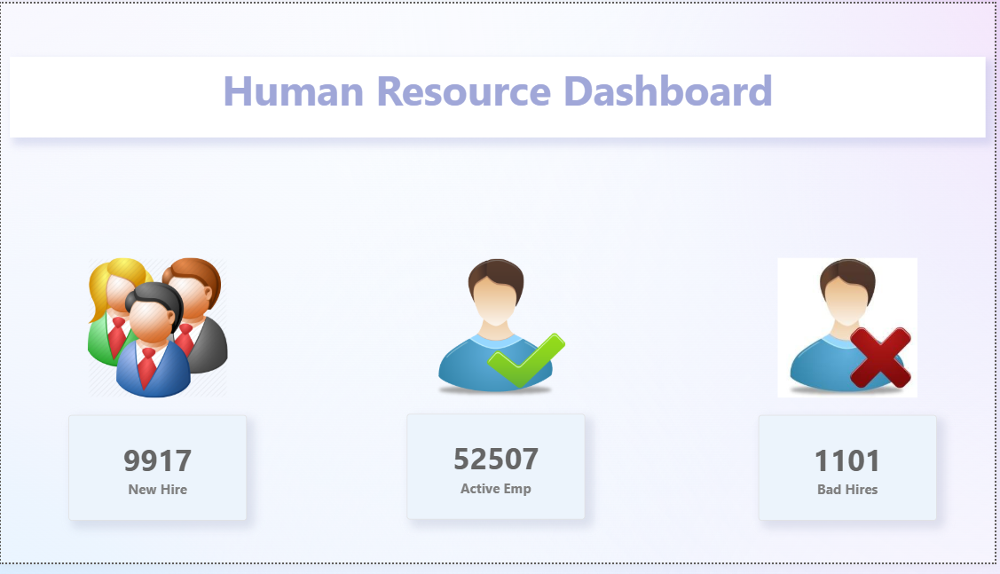
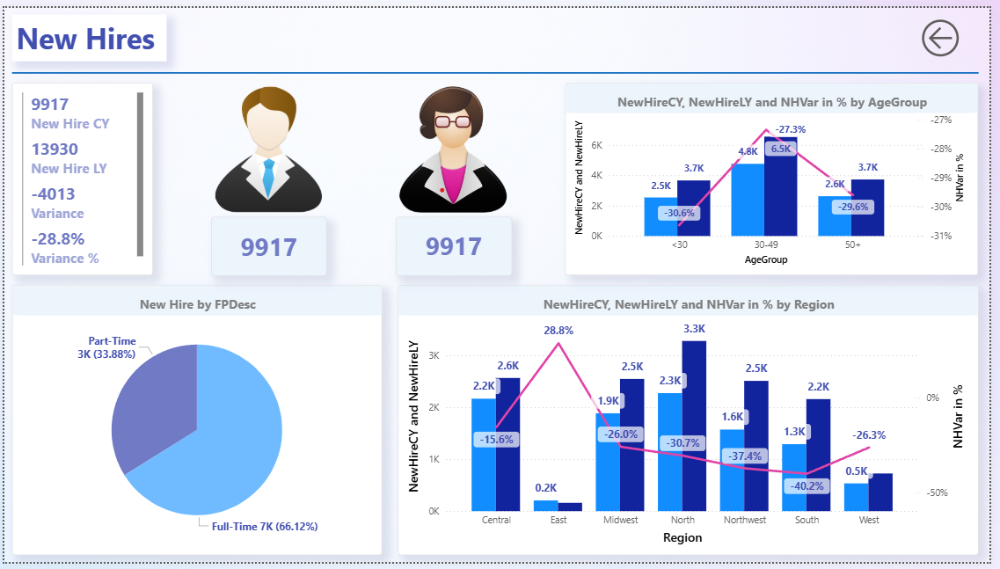
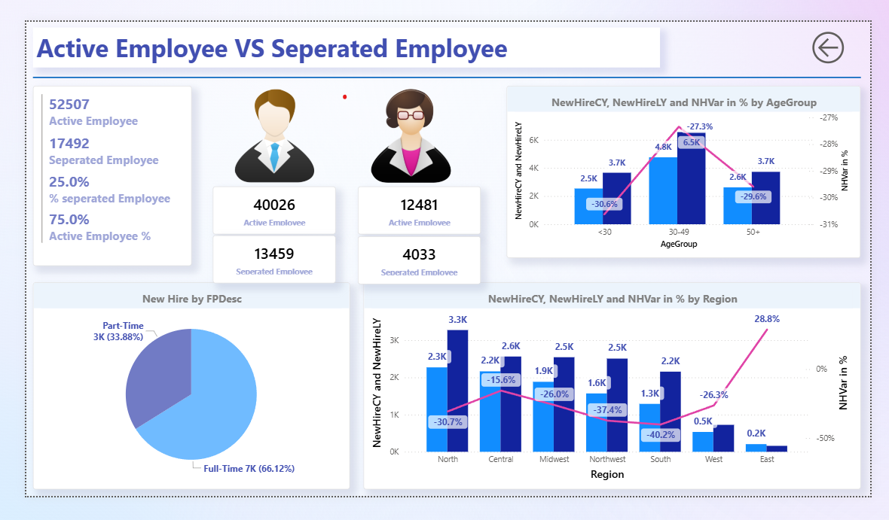
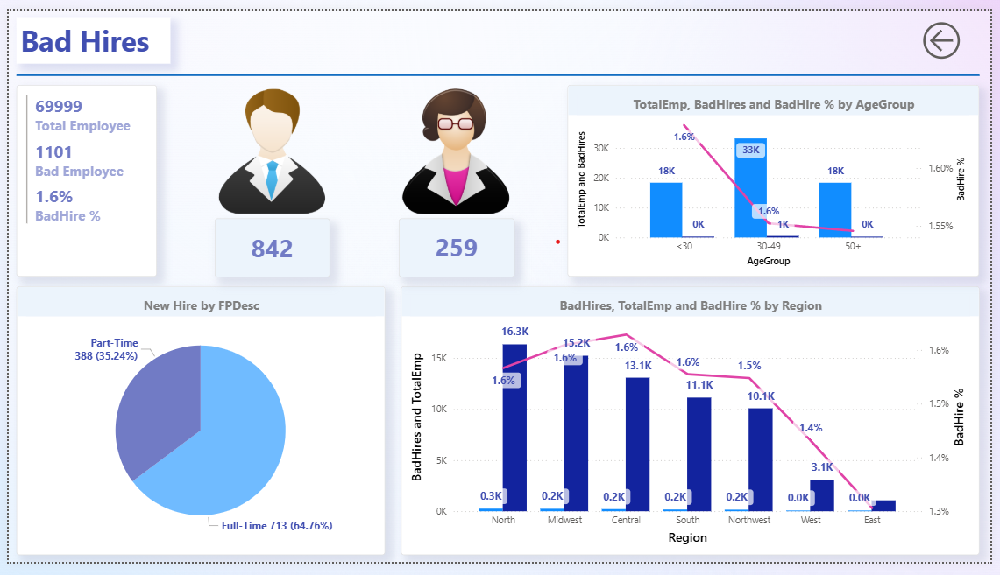

# 👩‍💼 Human Resource Dashboard - Power BI

## 🎯 Project Objective
This project demonstrates the use of **Power BI** to analyze HR data and provide insights into workforce management.  
The dashboard tracks **new hires, active employees, separations, and bad hires**, helping HR teams make data-driven decisions.

---

## 📂 Files in this Repository
- `Assignment 9.pbix` → Editable Power BI report file  
- `Power Bi Dashboard.pdf` → Exported report (for quick viewing)  
- `Dashboard_Page1.png` → Dashboard preview (Summary)  
- `Dashboard_Page2.png` → New Hire analysis  
- `Dashboard_Page3.png` → Active vs. Separated employees  
- `Dashboard_Page4.png` → Bad hires analysis  

---

## 🔑 Key Insights
- **New Hires**: 9,917 this year vs. 13,930 last year (📉 -28.8%)  
- **Active Workforce**: 52,507 employees, with a 75% retention rate  
- **Separated Employees**: 17,492 employees left (25% separation rate)  
- **Bad Hires**: 1,101 (1.6% of total employees)  
- **Workforce Type**: Majority are **full-time (66%)** compared to part-time (34%)  
- **Age Group Trends**: Highest hiring and separation observed in the **30-49** age group  
- **Regional Trends**: Variances in hiring and attrition across regions, with **East** and **South** showing significant separation rates  

---

## 📸 Dashboard Preview

### 📊 Summary

### 🆕 New Hires

### 👨‍💼 Active vs. Separated Employees

### ❌ Bad Hires

---

## 🛠 Tools & Skills Demonstrated
- **Power BI Desktop** for data modeling & visualization  
- **Power Query** for data cleaning & transformation  
- **DAX** (Data Analysis Expressions) for KPIs & calculations  
- Interactive dashboards for **HR Analytics**  

---

💡 *This is part of my Data Analytics portfolio. Explore more projects here: [Your GitHub Profile](https://github.com/yourusername)*  
